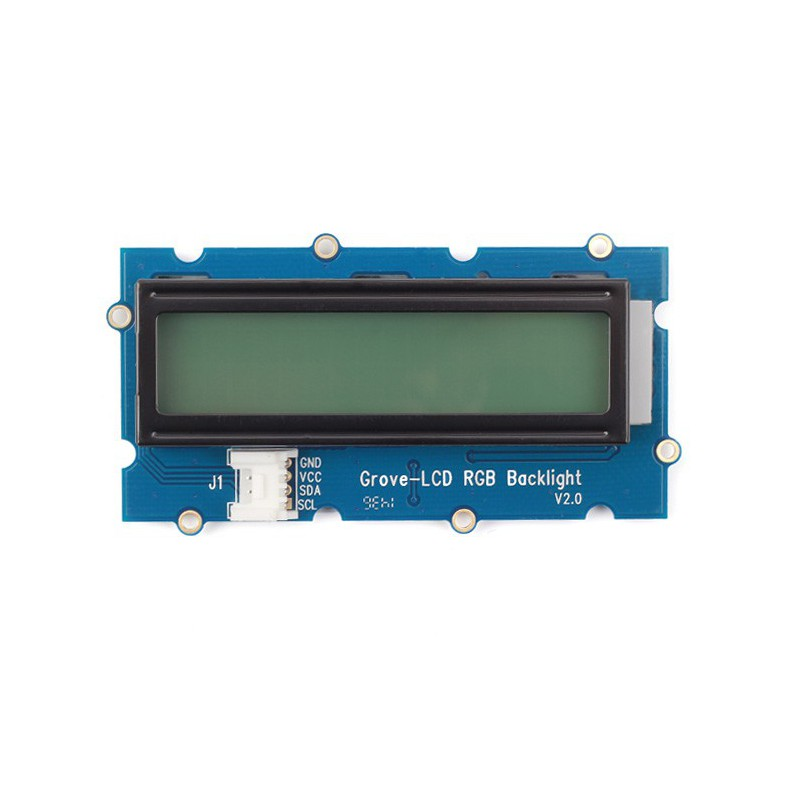

# Afficheur LCD RGB i2c sur Raspberry pi en C++

Ce projet contient 2 classes :

-Ci2c : classe de bas niveau d'accès au bus i2c
-- Ci2c() : Nécessite le numéro du bus et l'adresse de l'esclave
-- readFromI2c() : lecture de données sur le bus
-- writeToI2c() : écriture de données sur le bus

-rgb_lcd : Classe de gestion de l'afficheur LCD RVB i2c JHD1313M1
-- Bus de communication i2c : LCD = 0x3e / RGB = 0x62
-- Afficheur basé sur un LCM1602
-- https://cdn-shop.adafruit.com/datasheets/TC1602A-01T.pdf

-- Définition des commandes d'état de l'afficheur
-- Méthodes :	
-- rgb_lcd();
	
---begin(int cols, int rows, int charsize = LCD_5x8DOTS);
---clear();
---home();
---noDisplay();
---display();
---noBlink();
---blink();
---noCursor();
---cursor();
---scrollDisplayLeft();
---scrollDisplayRight();
---leftToRight();
---rightToLeft();
---autoscroll();
---noAutoscroll();
---createChar(int, int[]);
---setCursor(int, int); 
---int write(string text);
---command(int);
---setRGB(unsigned char r, unsigned char g, unsigned char b);               // set rgb
---setPWM(unsigned char color, unsigned char pwm){setReg(color, pwm);}      // set pwm
---setColor(unsigned char color);
---setColorAll(){setRGB(0, 0, 0);}
---setColorWhite(){setRGB(255, 255, 255);}
---blinkLED(void);
---noBlinkLED(void);

# L'afficheur

