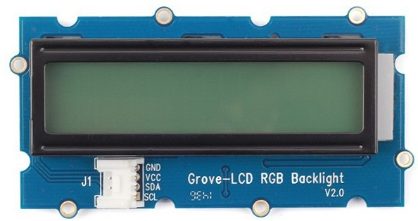

# Afficheur LCD RGB i2c sur Raspberry pi en C++

Ce projet contient 2 classes :

    -Ci2c : classe de bas niveau d'accès au bus i2c
        -- Ci2c() : Nécessite le numéro du bus et l'adresse de l'esclave
	-- readFromI2c() : lecture de données sur le bus
	-- writeToI2c() : écriture de données sur le bus

    -rgb_lcd : Classe de gestion de l'afficheur LCD RVB i2c JHD1313M1
	-- Bus de communication i2c : LCD = 0x3e / RGB = 0x62
	-- Afficheur basé sur un LCM1602
	-- https://cdn-shop.adafruit.com/datasheets/TC1602A-01T.pdf

	-- Définition des commandes d'état de l'afficheur
	-- rgb_lcd();
	-- Méthodes :
	---begin(int cols, int rows, int charsize = LCD_5x8DOTS);
	---void clear();
	---void home();
	---void noDisplay();
	---void display();
	---void noBlink();
	---void blink();
	---void noCursor();
	---void cursor();
	---void scrollDisplayLeft();
	---void scrollDisplayRight();
	---void leftToRight();
	---void rightToLeft();
	---void autoscroll();
	---void noAutoscroll();
	---void createChar(int, int[]);
	---void setCursor(int, int); 
	---int write(string text);
	---void command(int);
	---void setRGB(unsigned char r, unsigned char g, unsigned char b);               // set rgb
	---void setPWM(unsigned char color, unsigned char pwm){setReg(color, pwm);}      // set pwm
	---void setColor(unsigned char color);
	---void setColorAll(){setRGB(0, 0, 0);}
	---void setColorWhite(){setRGB(255, 255, 255);}
	---void blinkLED(void);
	---void noBlinkLED(void);

# L'afficheur

